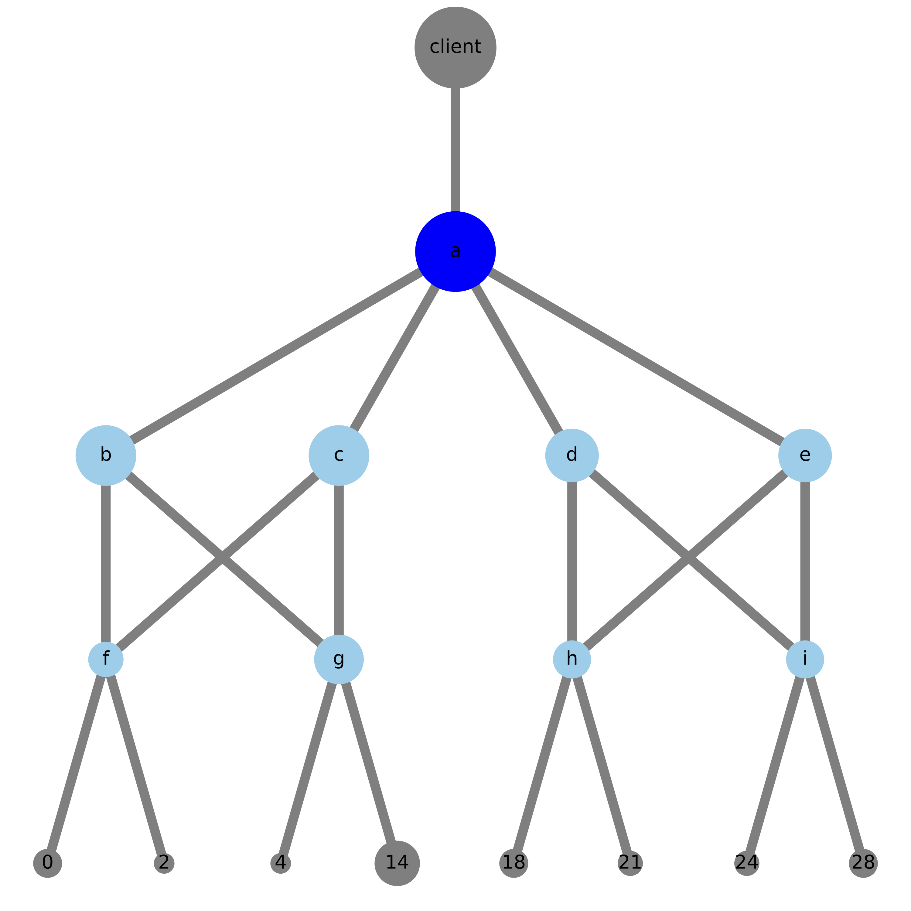
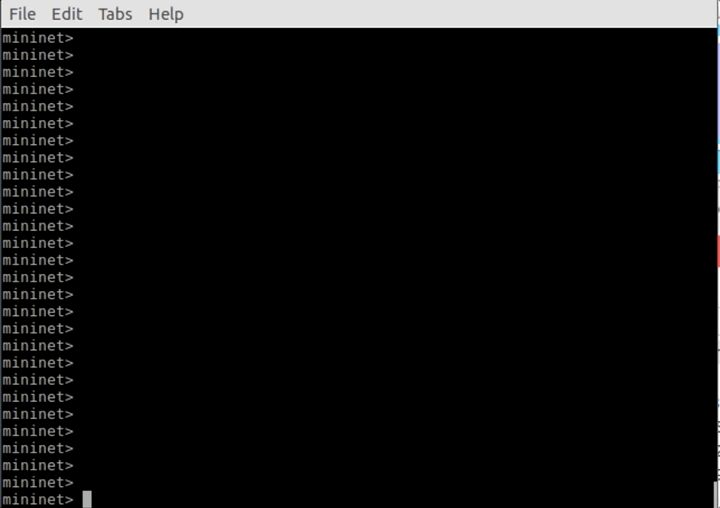

# No-hop
No-hop DHT utilizes the programable data plane to speed up the key value look up proccess for distributed hash tables.

## Initialize Network

No-hop has two versions, Forward, and Rewrite. Forward needs all switches to be programable while Rewrite only one. 

### Pre-built Expirements
In ````initialize_system/No_hop_forward_0```` and ````initialize_system/No_hop_rewrite_0```` there are two already built experirments.

To see the structure of the network look in either the ```` topology.json````file or in the ````network.pdf```` file.

**Network.pdf**

In rewrite systems only one switch needs to run No\_hop. This switch is in rewrite systems' ````network.pdf````dark blue. In forward all switches need to run No\_hop and are light blue in ````network.pdf````. The sizes are in relationship to the responisble id spaces.




### Generate Initial Build Files

**For additional experiments:**

**To generate a new rewrite experiment run:**
```bash
$ cd initialize_system/
$ python No_hop_Network.py rewrite
```

**To generate a new forward experiment run:**

```bash
$ cd initialize_system/
$ python No_hop_Network.py forward
```

If ```rewrite_build_folders=1```in ```No_hop_Network.py``` The experiment folder will be in ````No_hop_<forward, rewrite>_0````, else if ```rewrite_build_folders=0``` a new folder will be created with the next free index so, ````No_hop_<forward, rewrite>_<free_index>````

For more on generating build files please refer to [Init Docs](initialize_system/No_hop_Init_system.pdf).

## Running Experiments

**To run an experiment:**

```bash
$ cd initialize_system/<Build folder name>
$ make
```
This will start the network and mininet cli. 

In the mininet CLI to open a terminal for a host:


```bash
mininet> xterm host_name
```


**To see network:**

```bash
mininet> net
```


In a host xterm to run the No\_hop\_host program.

**To run a client:**

```bash
# python ../../No_hop_host.py c
```
**Sending messages:**


Format: type, id, message

**Type:**

| Value        | Message\_type       
| :------------- |:-------------:| 
| 0    | First\_contact | 
| 1     | Look\_up      | 
| 2 | Fail    |  
| 3 | Join    | 


**To run a server without an ID** (Will not run stabilize proccess until ID is assigned):


```bash
# python ../../No_hop_host.py
```

To assign an ID to a host, send with the client a message of type=1, ID=some id that sends to that host, message= join:ID that you want to assign.


**To run a test:**

```bash
# python ../../No_hop_host.py t=<Number of times each ID should be sent>
```


**To run hosts that immediatly start to stabilize pass them their ID at start:**

```bash
# python ../../No_hop_host.py ID
```


**Controller:**

To catch failures and adjust the tables, in another window the controller has to be run. 

```bash
# python ../../No_hop_controller.py
```


**To leave mininet:**

```bash
mininet> exit
```
**then:**

```bash
$ sudo mn -c
```

## Dependancies

Running No-hop expirements needs the P4 compiler, simple switch and grpc, so its easiest to use the [P4 tutorial VM](https://github.com/p4lang/tutorials). 

Additonally to generate the experiments one needs [Networkx](https://networkx.org/), and [matplotlib](https://matplotlib.org/). Matplotlib only to generate network.pdf diagram.
