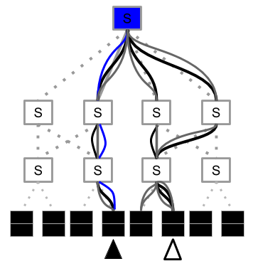

#  No-hop

No-hop DHT utilizes the programable data plane to speed up the key value look up proccess for distributed hash tables. 

No-hop includes two implementations that have different hardware requirments. No-hop -rewrite is losely modeled after [1-hop DHT](https://www.usenix.org/legacy/events/hotos03/tech/full_papers/gupta/gupta_html/). No-hop-rewrite needs only one programable switch in the entry path of all packets.

No-hop-finger-table is losely based on [CHORD DHT](http://cs.uccs.edu/~cs622/papers/01180543.pdf) . No-hop-finger-table benefits from smaller tables than No-hop-rewrite facilitated by Chord's novel finger table concept. No-hop-finger-table releis on all involved switches being programable.





### Dependancies
No-hop was implemented in the [P4tutorial virtual machine](https://github.com/p4lang/tutorials), No-hop also benefits from the use of the P4tutorail utilities programs.
### Controller
Make\_topology.py generate the controller data to program the [simple\_switch\_grpc](https://github.com/p4lang/behavioral-model/tree/master/targets/simple_switch_grpc), aswell make\_topology.py generates the json needed for [mininet](http://mininet.org/). If one does not want the json generated or other factors changed the Data\_Plane\_DHT\_Settings.py file contains some options.
### Compare\_classic\_v\_data\_plane
 Has the neccessary code to run an implementation of No-hop that also runs the classic chord and 1-hop for comparision. Included as well are a couple of test programs to compare the two.

### Important files

```
├── Controller
│   ├── Data_Plane_DHT.py
│   ├── Data_Plane_DHT_settings.py - basic settings (ring size, which implementation, ...)
│   ├── controller.py
│   ├── make_topology.py
│   ├── mycontroller.py
├── compare_classic_v_dataplane - folder for testing system versus the baseline, P4 code can proccess classic IP and No-hop packets. 
│   ├── compare_dht_ft.p4 - No-hop fingertable implementation
│   ├── compare_dht_rewrite.p4 - No-hop rewrite implementation
│   ├── logs - Logs and runtime requests of individual switches from most recent run through
│   ├── send_and_recieve_dht.py
│   ├── test_logs - Results from different test runs (zip files contain logs of all servers)
│   ├── test_hops.py
│   └── test_time.py 
├── figures - Figure generation scripts and figures
└── utils - Utilities from the P4 tutorials
    

```

